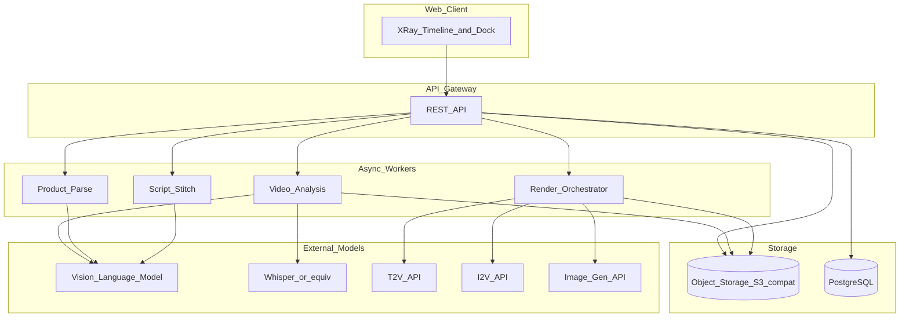
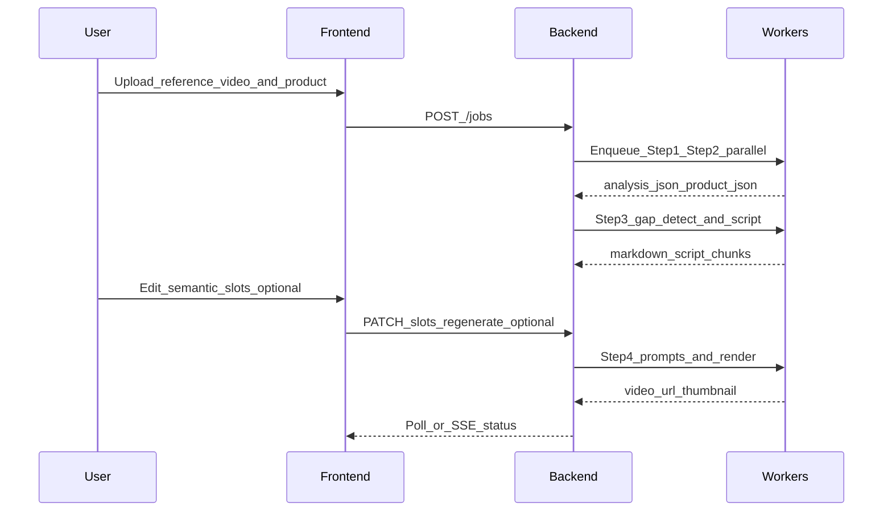
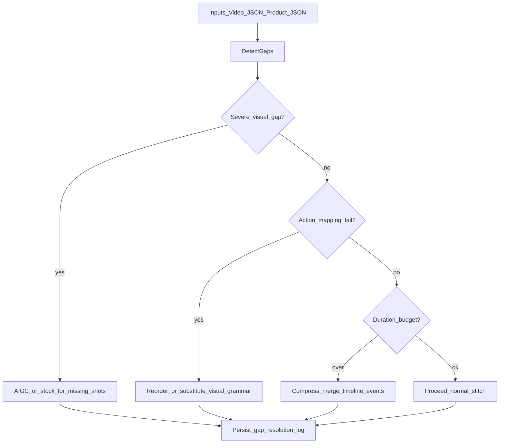
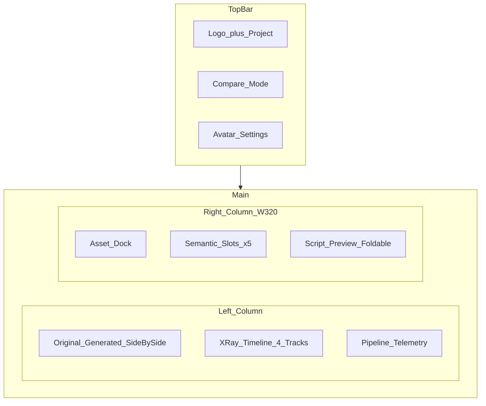

# MetaCut AI 短视频创作迁移平台 · 精炼 PRD（v1.0）

面向开发/产品与设计的**生产就绪**需求说明。在原「样例拆解 → 商品解析 → 剧本缝合 → 首帧垫图 & 视频生成」基础上，补充：范围界定、端到端契约、素材缺口治理、度量与路线图。

---

## 1. 执行摘要

MetaCut 是一个 **AI 创作系统**：对爆款样例视频做**结构化原子拆解**（脚本结构、镜头节奏、字幕样式、画面包装、转场、BGM 卡点等），将其中**可用的创作方法论**迁移到新主题、新品或用户素材上，产出可渲染的段落式剧本与视频。

**核心原则**

- **方法迁移**，非像素级拷贝：禁止复述原片文案/画面；输出须可审计为「新品 + 新场景」驱动。
- **素材不足可创作**：系统显式识别缺口，通过结构重排、文案补全、包装补全、AIGC 补全、既有素材复用等策略闭环。
- **工程可落地**：解析结果必须遵守固定 JSON Schema，并可直接对接渲染管线（Remotion / FFmpeg / 第三方 T2V-I2V API）。

---

## 2. 成功指标（KPI）

| 维度 | 指标 | MVP 目标 | 备注 |
|------|------|----------|------|
| 解析质量 | 时间轴单调性违规率（start&lt;end、递增） | &lt;1% | 自动校验拦截 |
| 解析质量 | 关键字段为空率（meta、narrative、rhythm） | &lt;5% | 需有人工抽检 |
| 剧本 | 剧本生成首次可渲染率（schema/规则校验通过） | ≥85% | 不含审美 |
| 剧本 | 用户编辑槽位后「重新生成」完成率 | ≥90% | |
| 视频 | 首帧与 Shot1 语义一致性（人工 5 分制） | ≥3.8 | 周度抽样 |
| 视频 | 单任务端到端 P50 延迟 | &lt;8 min | 不含排队；可拆分 step 看板 |
| 成本 | 单条成片 API 成本上限 | 产品定义预算 | 按 provider 分摊 |
| 安全 | 合规高风险输出拦截率 | 100% 进审或替换 | `compliance_risk` 驱动 |

**A/B 与评估**

- **剧本层**：同一输入下 A/B prompt/模型，对比「通过率 + 编辑次数 + 时长」。
- **视频层**：固定评估集（10 支样例 × 3 个跨品类 SKU），双人盲评 + checklist（节奏、卖货清晰度、违和感）。

---

## 3. 范围定义

### 3.1 MVP（必须交付）

1. Step1 样例视频解析 → **严格 JSON**（下文 Schema `version`）。
2. Step2 商品多模态 → **结构化商品 JSON**。
3. Step3 跨品类缝合 → **Markdown 结构化剧本**（含 ≤15s 分块规则）。
4. Step4 首帧英文 Prompt + **视频生成编排**（API Key 占位，可 mock）。
5. Web 工作台：**X-Ray Timeline + Asset Dock + Pipeline Telemetry + 剧本预览**；对比模式三态切换。
6. 素材缺口检测与至少 3 种补全策略（重排 / 文案 / AIGC）在服务端可执行路径上可演示。

### 3.2 非 MVP / 后续

- Supabase Realtime、多租户权限、计费、品牌素材库商业化。
- 全自动 Remotion 时间线导出（可先导出「中间 JSON」由工程二次开发）。
- 多语言本地化 UI（首期中文 + 解析 `language` 字段即可）。

---

## 4. 产品愿景与用户故事

**典型用户**：电商短视频运营、单品投流素材岗、小型 MCN。

**用户故事（示例）**

- 作为运营，我上传一支爆款参考视频和我的新品资料，系统输出**可拍的剧本**和**分镜级包装说明**，我只需替换实拍或接 T2V。
- 作为运营，当我的商品图只有 1 张时，系统仍给出**不崩结构**的短片方案，并标出**哪些镜头是 AIGC 补全**。

---

## 5. 端到端系统架构



**技术栈建议（可调整）**

| 层 | 建议 | 说明 |
|----|------|------|
| 前端 | Next.js 14+、TypeScript、shadcn/ui、Framer Motion | 暗色「数据工坊」主题 |
| 后端 | FastAPI、Celery/RQ、Redis | Step 异步与重试 |
| 存储 | PostgreSQL（任务状态/元数据）、S3 兼容（视频与中间 JSON） | |
| 视频分析 | FFmpeg、OpenCV（可选）、Librosa（节拍） | Telemetry 可与 LLM 步骤并列展示 |
| 模型 | API Key 环境变量注入，禁止硬编码 | 支持 mock 模式 CI |

**API Key 占位（环境变量示例，仅文档不要求实现）**

- `METACUT_VLM_KEY`、`METACUT_ASR_KEY`、`METACUT_T2V_KEY`、`METACUT_I2V_KEY`、`METACUT_IMAGE_KEY`
- 与模型配套的 **6 个可配置 Prompt** 占位见 [docs/prompts/README.md](prompts/README.md)（`01`–`06`，含建议环境变量名；正文由团队后期粘贴维护）。

---

## 6. 核心 Pipeline（Step 1–4）

### 6.1 总体数据流



---

## 7. Step 1：样例视频输入与解析

### 7.1 输入

- 单一参考视频文件；超长视频：**产品策略**为「按章节切段分析再合并」（MVP：单段时长上限 configurable，超限则拒绝或只做前 N 秒）。
- 可选：`file_name_hint`。

### 7.2 输出

- 符合 **VIDEO_ANALYSIS_SCHEMA** 的单 JSON 文档（Root 增加 `schema_version`、`job_id`、`source_uri`）。

### 7.3 解析 Prompt 规则（摘录自原 PRD）

- **仅输出纯 JSON**；以 `{` 开头 `}` 结尾；禁止 markdown 围栏。
- 时间戳：**原始视频时基 0s 起**，小数一位；`timeline_events`、切镜、`strong_beat_timestamps` 等须**单调不减**。
- 无法解析 → `null` / `[]`；未覆盖枚举 → `*_custom`。

### 7.4 校验与错误处理

| 错误类型 | HTTP/任务状态 | 处理 |
|----------|---------------|------|
| 文件损坏/无法解码 | 400 / failed | 提示重新上传 |
| 超出时长上限 | 413 / failed | 提示切段或裁剪 |
| JSON Schema 校验失败 | 422 / retry | 最多重试 2 次；仍失败标记 `needs_human_review` |
| 外部模型超时 | 504 / retry | 指数退避 3 次 |

### 7.5 重试策略

- Schema 校验失败：附带**上一次违规摘要**注入 repair prompt（简短）。
- 模型 5xx：重试；429：尊重 `Retry-After`。

---

## 8. VIDEO_ANALYSIS_SCHEMA（含 version 与必填项）

```json
{
  "schema_version": "video_analysis/v1",
  "job_id": "string|null",
  "source_uri": "string|null",
  "meta_info": {},
  "narrative_structure": {},
  "visual_and_color": {},
  "audio_and_beats": {},
  "camera_and_composition": {},
  "marketing_hooks": {},
  "rhythm_and_density": {},
  "product_fit_info": {},
  "compliance_risk": {},
  "style_aesthetics": {},
  "on_screen_texts": [],
  "bgm_details": {}
}
```

**必填（MVP），缺失则校验失败或可降级为 blocker：**

- `schema_version`
- `meta_info.duration`、`meta_info.aspect_ratio`
- `narrative_structure.timeline_events`（至少 1 条）
- `rhythm_and_density.shot_count`、`rhythm_and_density.avg_shot_duration`
- `camera_and_composition.camera_transitions`
- `compliance_risk.risk_level`

**与原 PRD Schema 的一致性**

- 各子对象字段定义、枚举与原 PRD **保持一致**；实现侧用 JSON Schema/OpenAPI 生成校验器。
- **`rhythm_and_density` 与 `timeline_events`**：服务端二次校验时长统计自洽（容差 ±0.2s）。

---

## 9. Step 2：商品信息拆解

### 9.1 输入

- 文本、图片、短视频（可多模态）；统一到「商品画布」表单 + 附件列表。

**Prompt 占位**：6 个提示词文件见 [docs/prompts/README.md](prompts/README.md)；Step2 对应 [02-product-parse.system.md](prompts/02-product-parse.system.md)。可参考已写满示例 [_reference/02-product-parse-v1.filled.md](prompts/_reference/02-product-parse-v1.filled.md)。

### 9.2 输出（PRODUCT_SCHEMA）

```json
{
  "schema_version": "product/v1",
  "job_id": "string|null",
  "product_name": "string",
  "category": "string",
  "core_selling_points": ["string"],
  "visual_description": "string",
  "usage_method": "string",
  "target_audience": "string",
  "usage_scene": "string",
  "ingredients_material": "string|null",
  "spec_size": "string|null",
  "pain_point_gain_point": "string|null",
  "user_asset_inventory": {
    "product_images_count": "int",
    "product_video_clips_count": "int",
    "has_logo_pack": "bool",
    "has_endcard": "bool"
  },
  "_custom": {}
}
```

**必填**：`product_name`、`category`、`core_selling_points`、`visual_description`、`usage_method`、`target_audience`、`usage_scene`、`user_asset_inventory`。

### 9.3 错误与重试

- 图文严重不符 → 返回 `ambiguous_product` + 让用户勾选主图。
- OCR/抽帧失败 → 降级为「仅文本商品卡」仍可进入 Step 3，但 **缺口模块**标记 `VISUAL_UNDERPROVISIONED`。

---

## 10. Step 3：内容迁移与剧本生成

### 10.1 输入

- Step1 JSON + Step2 JSON + （可选）用户编辑后的语义槽。

### 10.2 输出

- **Markdown 结构化剧本**，严格遵循原 PRD 模板（「剧本基础信息」「区块」「镜头明细」）。
- （工程建议）并行输出 **`script_manifest.json`**：区块边界、镜头起止、`narrative_stage`、是否为 `continuation_block`，便于前端铺满时间轴对比模式。

### 10.3 硬规则（节选）

- 单段生成 **≤15s**；总长 &gt;15s 须在 **Cut 类物理切镜** 处拆分；禁止运动镜头中途切断。
- 映射公式：镜头语言、画面交互、叙事内容、人声、音效、背景音乐、花字与原 PRD 一致。
- **跨品类**：剥离原产品外观；`product_actions` 无法对应时降为 `appear|rotate|zoom` 等无害动作。

### 10.4 错误与重试

- Markdown 层级解析失败 → 重试；仍失败降级为 JSON-only 管线（后端内部，不Expose 给用户）。
- 用户修改语义槽触发 **增量重生成**：仅重算受影响 `stage`（实现目标）。

---

## 11. 素材缺口检测与补全策略

### 11.1 缺口类型枚举

| 代码 | 含义 | 示例 |
|------|------|------|
| VISUAL_UNDERPROVISIONED | 用户商品实拍/可控素材不足 | 仅 1 张白底图却要大量 usage_demo |
| ACTION_MISMATCH | 参考视频动作无法映射到新品 | 「拧盖」→ 零食袋 |
| SCENE_MISMATCH | 参考场景与用户场景冲突且不期望 | 厨房 vs 户外露营（若用户未选户外）|
| PERSONA_MISMATCH | 人物设定与 TA 不符 | 需切换主体性别/年龄特质 |
| DURATION_OVER | 总长无法在用用户素材填满 | 自动压缩叙事 |

### 11.2 决策（简化）



### 11.3 策略矩阵

| 缺口 | 优先策略 | 次选 | 须在 UI 明示 |
|------|----------|------|----------------|
| 缺镜头素材 | AIGC 场景 + 保留商品主体结构（ControlNet） | 收窄 `usage_demo` 段落 | 「本镜为 AI 补足」|
| 动作无法复刻 | 改叙事为「开箱/手拿/桌前展示」 | 特效替代 | ✅ |
| 场景不符 | 以用户 `usage_scene` 重写情境 | — | ✅ |
| 总长过高 | 合并相邻同情绪事件 | 删减弱 CTA 重复 | 可选 |

### 11.4 伪代码（服务端）

```
function stitchWithGaps(videoJson, productJson, userOverrides):
    gaps = detectGaps(videoJson, productJson)
    plan = ResolutionPlan([])
    for g in gaps:
        plan.push(resolve(g))  # 优先级见矩阵
    scriptMd = llmGenerateScript(videoJson, productJson, plan, userOverrides)
    assertMarkdownStructure(scriptMd)
    return { scriptMarkdown: scriptMd, gapPlan: plan }
```

---

## 12. Step 4：首帧垫图与视频生成

### 12.1 输入

- 剧本中 **Shot 1 拆解板**、全局视觉锚点、商品特征摘要；可选用户商品抠图/Reference。

### 12.2 输出

- `first_frame_prompt`（英文正向/反向 + 宽高比）。
- （工程）渲染任务：`chunk_videos[]` URL、拼接后 `final_video` URL、`cover_thumbnail` URL。

### 12.3 静态首帧法则

- **剔除全部动态措辞**；仅描述 **t=0 静止**构图；材质与光影强绑定写法保留。

### 12.4 封面与溯源

- 若用户上传清晰商品外貌：走「美化 + ControlNet Depth/Lineart」建议参数（与原 PRD 一致）；产出封面帧进入对象存储并在剧本预览「预览末帧/首帧」可替换。

### 12.5 错误与降级

| 场景 | 行为 |
|------|------|
| 图生成审核失败 | 使用「安全模板」重新出图或阻塞并提示修改 |
| I2V 仅支持短段 | 严格按 Chunk 投递；Concat 在后端 FFmpeg |
| GPU 配额耗尽 | 排队 + Telemetry 明示 ETA |

---

## 13. 交互设计与 UI PRD（精炼）

### 13.1 设计关键词与 Token

专业 · 透明 · 数据驱动 · 科幻高效  

**配色（CSS Variables）**：与原 PRD 一致（`#0B0E14`、`#00F0FF`、`#F5B041`、磨砂玻璃、轨道配色、阶段配色）。

### 13.2 桌面布局（≥1280px）— Mermaid



### 13.3 对比模式数据源

| 模式 | Timeline 数据源 |
|------|-----------------|
| 原视频 | Step1：`camera_transitions`、`on_screen_texts`、`audio_and_beats` 等映射为轨道 |
| 生成剧本 | `script_manifest` 或 Markdown 解析：镜头边界、人声→字幕、`narrative_stage` 色带 |
| 并排 | 双时间轴共用 playhead |

**字幕**：有词级数组则 Karaoke；否则句级降级 +「单词/句子」开关。**双语**：后端译文字段预留 `transcript_secondary`。

### 13.4 语义槽映射（与用户编辑）

| Narrative tag | Slot |
|---------------|------|
| hook | HOOK |
| problem_agitation | PROBLEM |
| solution_intro / usage_demo | SOLUTION |
| product_detail / testimonial | EVIDENCE |
| cta / closing | CTA |

- 槽位可编辑；**重置为 AI 推荐**；可选「保存即触发剧本局部重生成」。

### 13.5 Pipeline Telemetry

- 轮询：`GET /api/analysis/{id}/status` **1s**（MVP）；状态：waiting / processing / success / failed。
- 全部成功后 **塌缩摘要**：`N 模型 · 耗时 · M 资产`；点击查看日志。

### 13.6 CTA 汇聚动画

- ≤20 卡片：贝塞尔曲线汇聚；>20：**仅芯片旋转**。提供 **跳过动画** → 立即填槽并展开剧本预览与对比切换高亮。
- **不跳转 Tab**：主工作台常驻。

### 13.7 响应式（&lt;1280px）

- 右侧 Drawer；CTA FAB；时间轴横向滚动；Telemetry 区域内滚动。

### 13.8 前端状态机（概要）

```
Idle → Uploading → Analyzing → SlotsReady → (UserEdit) → ScriptGenerating → Rendering → Completed | Failed
```

失败态：可「从 Step X 重试」；不改变已上传素材引用。

---

## 14. 数据一致性矩阵（前后端）

| 数据项 | 来源 | 展示 | 冲突 |
|--------|------|------|------|
| 切镜/镜头块 | Step1 vs Step3 | Timeline | **对比切换**，不同源不同时展示 |
| 字幕 | transcript vs 人声 | 字幕轨 | 对比切换 |
| 语义槽 | Step3 → 用户 | Dock | PATCH 后以用户版本为准触发重算 |
| 资产卡片 | Step1(+Step3 enrich) | Dock | 「爆款资产」「生成资产」视图切换可选 |

---

## 15. API 契约示意（后端实现指引）

```
POST /api/jobs                    body: multipart or refs → job_id
GET  /api/jobs/:id/status         steps[]: { name, status, progress, message }
GET  /api/jobs/:id/artifacts      urls to video_analysis.json, product.json, script.md
PATCH /api/jobs/:id/slots        body: { HOOK?, PROBLEM?, ... }
POST /api/jobs/:id/regenerate    query: partial|full
POST /api/jobs/:id/render       body: chunk options
```

（具体 OpenAPI 由工程 repo 签发；本文为 PRD 级约定。）

---

## 16. 风险与缓解

| 风险 | 影响 | 缓解 |
|------|------|------|
| 模型幻觉输出违规文案/画面 | 品牌与合规 | `compliance_risk` pipeline + 人工抽检 + 生成前替换词表 |
| 长视频解析成本爆炸 | 预算 | 时长上限 + 切段 + 「仅解析黄金 30s」快速模式 |
| I2V 跨段不连贯 | 成片质量 | Chunk 首尾帧对齐；用户可替换「区块末帧」 |
| UI 并行开发不同步接口 | 工期 | Mock server + fixtures（样例 JSON 入库）|

---

## 17. 实施路线图

| 阶段 | 交付 | 周期量级（参考） |
|------|------|------------------|
| P0 | Step1 Schema 校验 + Timeline「原视频」模式 + Telemetry mock | 1–2 周 |
| P1 | Step2 + Step3 Markdown + Manifest + 语义槽编辑 | 2–3 周 |
| P2 | 对比三态 + 剧本预览 + 缺口策略可观测（gapPlan UI） | 2 周 |
| P3 | Step4 Prompt + Chunk 队列 + FFmpeg 拼接 + 首帧管线 | 2–4 周 |
| P4 | KPI 打点、抽样评估工具、成本控制开关 | 持续 |

---

## 18. 附录 A：原版 Step3 段落剧本模板（保持不变）

以下为输出格式约束摘录（完整模板以原 PRD 为准，此处不删减业务规则）。

- **## 【剧本基础信息】**：剧本名称、总时长、分辨率、宽高比、渲染策略、全局视觉锚点。
- **## 【区块 n】**：起止秒、渲染模式（T2V vs I2V_Continuation）、参考帧说明。
- **镜头子项**：镜头语言 / 画面交互 / 叙事内容 / 人声 / 音效 / 背景音乐 / 屏幕花字。
- **区块 2+**：叙事内容前缀 `Continuing exactly from the reference frame.`

---

## 19. 附录 B：首帧 Prompt 模块（保持不变）

- 输出结构：**应用场景、宽高比、正向英文 Prompt、反向 Prompt、工程策略（ControlNet/Denoising）**。
- **静态帧法则**与 **材质-光影绑定**、**色彩锚点** 与原 PRD 一致。

---

## 20. 文档变更记录

| 版本 | 日期 | 说明 |
|------|------|------|
| v1.0 | 2026-05-25 | 首版精炼：范围、契约、缺口、架构、KPI、路线 |

---

**End of MetaCut PRD Refined**
