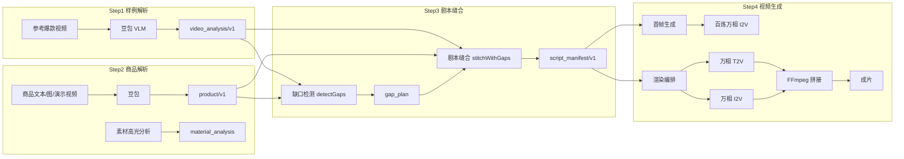

# MetaCut 项目说明文档

> **爆款结构迁移引擎**：从样例拆解、素材补全到视频重组的 AI 创作平台

---

## 1. 整体 AI 架构

### 1.1 设计原则

- **方法迁移，非内容复制**：保留爆款样例的叙事骨架与节奏表达，替换为新品内容与用户素材。
- **素材不足可创作**：显式识别结构槽位缺口，通过结构重排、文案补全、包装补全、AIGC 补全、素材复用等策略闭环。
- **工程可落地**：各 Step 输出遵守固定 JSON/Markdown 契约，可直接对接渲染管线。

### 1.2 四步 Pipeline

| Step | 能力 | 模型/引擎 | 核心输出 |
|------|------|-----------|----------|
| Step 1 | 样例视频原子解析 | 豆包 Doubao-Seed VLM | `video_analysis/v1`：叙事九段、节奏、包装、七维内容策略 |
| Step 2 | 商品多模态解析 | 豆包 | `product/v1`：8 字段商品特征；演示视频高光片段 |
| Step 3 | 缺口检测 + 跨品类缝合 | 规则引擎 + 豆包（失败则规则 fallback） | `gap_plan` + Markdown 剧本 + `script_manifest/v1` |
| Step 4 | 分块渲染 + 拼接 | 百炼万相 2.6 + FFmpeg | 分块视频、首帧、封面/卖点卡、成片 |

### 1.3 横切能力

| 能力 | 说明 |
|------|------|
| **X-Ray 时间轴** | 样例/生成双轨四通道（切镜、字幕、音效、视觉标签），与视频播放进度对齐 |
| **AI 导演** | 自然语言意图解析 → Tool-Use 调用 → 重生成剧本 / 重跑区块，支持撤销 |
| **工作台状态机** | 四 Tab 阶段锁定、完成条件检测、下一步引导 |

### 1.4 视频「结构」定义

系统将样例视频的「结构能力」拆解为三类信息：

1. **脚本/段落结构**：`narrative_structure.timeline_events`，覆盖开场钩子、痛点放大、引入方案、产品展示、使用演示、用户证言、价格优惠、行动号召、结尾收束等叙事阶段。
2. **节奏结构**：`rhythm_and_density`（镜头数、平均镜长、语速）+ `camera_and_composition.camera_transitions`（切镜时间点与类型）+ BGM 卡点。
3. **包装结构**：`on_screen_texts`（花字/字幕密度与样式）+ `content_strategy` 七维策略（话题、钩子、结构公式、情绪、受众需求等）。

迁移时保留上述结构骨架，将内容替换为新品信息。

### 1.5 素材缺口治理（§11）

**缺口识别**（确定性规则，非 LLM 判断）：

| GapCode | 含义 |
|---------|------|
| `VISUAL_UNDERPROVISIONED` | 用户素材数量不足以支撑目标镜头结构 |
| `ACTION_MISMATCH` | 样例复杂操作与商品类目不匹配 |
| `SCENE_MISMATCH` | 样例场景与用户素材场景冲突 |
| `PERSONA_MISMATCH` | 目标人群与画面人设不一致 |

**三层 Fallback Ladder**（逐镜素材决策）：

1. **Tier 1**：匹配用户商品图 / 演示视频片段
2. **Tier 2**：无害叙事降级（动作降级、场景改写、人设调整）
3. **Tier 3**：AIGC 补镜（keyframe + I2V / 纯 T2V）

用户可在 UI 选择五类补全策略（结构重排、文案补全、包装补全、AIGC 生成、素材复用），应用后触发剧本重写。

---

## 2. 工具协议

「工具协议」指系统内部 AI 与业务能力之间的调用约定，包括数据契约、Agent 工具定义、Prompt 输出规范与渲染编排协议。

### 2.1 Pipeline 数据契约

各 Step 之间通过固定 Schema 传递，禁止自由文本直接接入渲染：

| 契约 | 版本 | 关键字段 |
|------|------|----------|
| 样例解析 | `video_analysis/v1` | `meta_info`、`narrative_structure.timeline_events`、`rhythm_and_density`、`content_strategy`、`compliance_risk` |
| 商品解析 | `product/v1` | `product_name`、`category`、`selling_points`、`target_audience`、`usage_scene` 等 8 字段 |
| 剧本清单 | `script_manifest/v1` | `blocks[]`（≤15s 分块）、`shots[]`（镜号、叙事阶段、资产来源、缺口标记） |
| 缺口计划 | `gap_plan` | `gaps[]`（GapCode + 影响镜头）、`resolutions[]`（补全策略） |

类型定义见 [`lib/types/pipeline.ts`](../lib/types/pipeline.ts)。

### 2.2 AI 导演 Tool-Use 协议

用户自然语言经意图解析后，映射为标准 `DirectorAction`，由 `executeDirectorActions` 执行：

| 工具名 | 功能 | 主要参数 | 副作用 |
|--------|------|----------|--------|
| `updateStageBrief` | 更新镜头阶段说明 | `narrative_stage`、`stage_brief`、`shot_index?` | 触发剧本重生成 |
| `regenerateScript` | 重生成全篇剧本 | — | 更新 `scriptMarkdown` + `scriptManifest` + `gapPlan` |
| `rerunBlock` | 重跑指定渲染区块 | `block_index` | 更新对应 `chunkVideos`，可选 cascade 联动后续区块 |
| `switchRenderModel` | 切换渲染模式重跑 | `block_index`、`mode`（t2v/i2v/r2v） | 同上 |

定义见 [`lib/director/tools.ts`](../lib/director/tools.ts)。执行前自动快照，支持一键撤销。

各 Tab 快捷话术（预置提示）：

- 参考：分析更细、突出节奏与转场、提取花字
- 商品：卖点更聚焦、补充使用场景、语气更年轻化
- 剧本：开头更抓人、减少字幕密度、加强 CTA
- 渲染：重跑区块、改用 r2v、节奏更紧凑

### 2.3 Prompt 输出协议

共 7 个 Prompt 位点（`docs/prompts/01`–`07`），与 Pipeline Step 一一映射。

**核心分工边界**：

- **LLM 负责**：创意文案、画面描述、叙事表达（Markdown 剧本）
- **工程层负责**：`asset_source`、`gap_codes`、`fallback_applied` 由服务端 `resolveShotFallback` 根据 `gap_plan` **确定性叠加**，LLM 不得自行输出这些字段

**各 Step 输出格式**：

| Step | 输出格式 | 约束 |
|------|----------|------|
| Step 1 解析 | 纯 JSON | 以 `{` 开头；时间戳单调不减；失败触发 repair 重试 |
| Step 2 商品 | 纯 JSON | 8 字段原子提取；脏字段增量合并 |
| Step 3 缝合 | Markdown 剧本 | 含分块标题、镜头表、仿写对照；服务端解析为 Manifest |
| Step 4 渲染 | 英文 Prompt | T2V/I2V 语义保持约束；首帧与 Shot1 对齐 |

LLM 调用失败时，Step 3 与 AI 导演意图解析均回退至确定性规则引擎（`stitchWithGapsRules`、`parseDirectorIntentRules`），保证演示链路不中断。

### 2.4 渲染编排协议

- **分块规则**：按 15s 物理硬切点拆分渲染区块（`splitTimelineIntoBlocks`）
- **模式选择**：区块 1 默认 T2V；后续区块按资产来源选择 I2V（有首帧/商品图）或 T2V
- **重跑策略**：`single`（仅重跑指定区块）/ `cascade`（联动重跑后续区块）
- **异步任务**：渲染支持 Job 轮询（`GET /api/render/jobs/[id]`），前端展示 `renderSteps` 日志
- **Mock 协议**：未配置 `DASHSCOPE_API_KEY` 时自动进入 Mock 模式，输出占位示例，前端通过配置告警横幅明示

### 2.5 外部模型调用协议

| Provider | 用途 | 环境变量 |
|----------|------|----------|
| 豆包（火山方舟） | Step 1/2/3 解析与缝合、AI 导演、素材分析 | `DOUBAO_APIKEY`、`DOUBAO_EP` |
| 百炼万相 | Step 4 生图/生视频 | `DASHSCOPE_API_KEY` |
| FFmpeg | 多区块拼接、花字烧录 | 系统级依赖 |
| PostgreSQL | 项目与任务持久化 | `DATABASE_URL` |
| S3 兼容存储 | 视频/图片/中间 JSON | `S3_ENDPOINT`、`S3_ACCESS_KEY_ID` 等 |

模型配置中心：[`lib/model-config.ts`](../lib/model-config.ts)。

---

## 3. AI 工具使用说明及自主设计

### 3.1 AI 工具使用

| 阶段 | 工具 | 用途 |
|------|------|------|
| 策略设计辅助 | Google Gemini、Cursor Plan 模式 | 课题拆解、四 Tab 架构规划、视频「结构」概念讨论、API 契约设计 |
| Prompt 调优 | Google AI Studio | 各 Step Prompt 的迭代测试与效果对比 |
| 网站搭建 | Cursor Agent 模式、Sealos DevBox | 全栈编码（Next.js + TypeScript + 21 个 API 路由）；远程 Linux 联调、`npm run build`、模型 API 与部署验证 |
| 运行时 AI | 豆包 VLM、百炼万相 2.6 | 视频解析、商品解析、剧本缝合、生图/生视频 |

**使用原则**：允许 AI 辅助方案设计、编码实现、Prompt 调优与内容生成；核心思路、任务拆解、产品设计与关键功能实现由参赛者自主完成。参考剪映/即梦等产品的交互形态，自建「方法迁移」引擎，非黑盒调用现成产品直接出片。

### 3.2 自主设计环节

本人在项目搭建中的自主设计环节包括：

1. **界面 UI 设计**：暗色数据工坊主题下的色彩体系、信息排版，以及侧栏导航、主舞台、AI 导演右栏与 X-Ray 底栏之间的联动交互。
2. **全链路分 Tab 逻辑顺序**：参考视频解析 → 商品多模态 → 剧本编排 → 视频生成的阶段优先级，以及「剧本依赖前两步完成、渲染依赖剧本确认」的锁定与引导规则。
3. **样例视频解析（Step 1）**：定义样例需落地的原子化结构（叙事九段、节奏、包装及七维内容策略），以及 X-Ray 时间轴的信息接口、四轨可视化与视频进度对齐。
4. **商品多模态解析（Step 2）**：定义商品侧需落地的原子化字段 Schema，支持解析结果的人工修改、脏字段追踪与单字段润色回写。
5. **剧本编排（Step 3）**：设计 Step 1/2 信息如何映射为可渲染的结构化剧本（15s 分块、剧本映射逻辑、结构化输出）；样例与新剧本的对比路径；剧本可编辑与多版本（高点击/高转化/高节奏/高质感）输出；以及素材缺口识别规则与五类补全策略、三层 Fallback 的工程治理。
6. **视频生成（Step 4）**：样例与成片对比展示、结构槽位对照，以及封面与卖点卡片等包装生成能力。
7. **全局横切能力**：AI 导演的自然语言意图解析、修改后的联动更新（重生成剧本/重跑区块），以及各 Tab 差异化快捷话术；X-Ray 双轨信息接口、可视化与播放进度同步。
8. **Prompt 设计及调优**：7 个 Prompt 位点与 Pipeline 映射。

### 3.3 自主设计与工具对照总览

| 逻辑 | 自主设计 | 工具 |
|------|----------|------|
| UI 设计 | ✓ | - |
| 全链路的分 Tab 逻辑顺序 | ✓ | - |
| Tab 1：样例视频解析 | ✓ | 豆包 VLM |
| Tab 2：商品多模态解析 | ✓ | 豆包 |
| Tab 3：剧本编排 | ✓ | 豆包 |
| Tab 4：视频生成 | ✓ | 百炼万相 |
| 全局横切能力（AI 导演、X-Ray） | ✓ | 豆包 |
| Prompt 设计及调优 | ✓ | Google AI Studio |

---

## 4. 安全边界

### 4.1 密钥与配置安全

- 所有模型 API Key 通过**环境变量**注入（`.env.local`），禁止硬编码进代码仓库或说明文档。
- 主要变量：`DOUBAO_APIKEY`、`DOUBAO_EP`、`DASHSCOPE_API_KEY`、`DATABASE_URL`、`S3_*`。
- 配置状态通过 `GET /api/config/status` 暴露能力清单，前端 `ConfigStatusBanner` 对评审**诚实披露**当前环境能力。

### 4.2 访问控制

- 公网部署入口配置 `METACUT_REVIEW_ACCESS_CODE` 评审访问码（`ReviewAccessGate`），防止未授权访问与 API 滥用。
- 未配置访问码时，系统顶部告警提示「公网入口没有访问码保护」。

### 4.3 内容合规边界

- Step 1 解析输出 `compliance_risk.risk_level` 字段，为后续审核提供依据。
- 缝合 Prompt 明确约束：**禁止复述样例视频原文案与画面**，仅迁移创作方法与结构节奏。
- 仿写对照面板展示「样例段 ↔ 新方案」语义映射，确保可审计为「新品 + 新场景」驱动。

### 4.4 能力诚实披露（Mock 边界）

| 场景 | 行为 |
|------|------|
| 未配置豆包 Key | 视频解析与剧本生成不可用，前端告警 |
| 未配置百炼 Key | 渲染自动进入 Mock 模式，成片为占位示例，告警明示 |
| 未安装 FFmpeg | 多区块无法自动拼接，告警提示 |
| 未配置数据库 | 项目无法跨重启恢复，告警提示 |
| 未配置对象存储 | 上传资产回退本地文件，告警提示 |

评审可据此区分「真实 AI 能力」与「降级演示」，避免误判。

### 4.5 工程防幻觉边界

- **缺口检测**由确定性规则引擎完成（`gap-detection.ts`），不依赖 LLM 判断素材是否充足。
- **资产来源与缺口标记**由服务端 `resolveShotFallback` 强制叠加，LLM 无法自由编造 `asset_source` 或隐藏 AIGC 补全镜。
- **时间轴校验**：解析结果须满足时间戳单调不减；剧本 manifest 与样例 `timeline_events` 按序号 1:1 对齐，防止结构漂移。

### 4.6 数据存储边界

- 用户上传的视频/图片默认存入 S3 兼容对象存储；未配置时回退本地 `public/uploads`。
- 项目元数据与渲染任务状态存入 PostgreSQL（`lib/project-store.ts`、`lib/render-job-store.ts`）。
- `.env.local` 等敏感配置文件不纳入代码同步（见 `AGENTS.md` 同步排除规则）。

### 4.7 运行稳定性边界

- **样例视频时长建议**：为兼顾解析与渲染稳定性，建议样例视频控制在 **30 秒左右**（约 2 个 15s 渲染区块）。
- **更长视频的处理方式**：系统按 `splitTimelineIntoBlocks` 以 15s 物理硬切点继续拆分，理论上支持更长输入。
- **已知风险**：显著超过建议时长时，豆包 VLM 解析、万相 2.6 异步任务、多区块 FFmpeg 拼接等链路更容易出现超时、接口不稳定或渲染失败；属**诚实披露的运行边界**，评审演示时应优先使用短样例。
- **与 Mock 边界的区别**：此类失败可能发生在已配置完整 API Key 的真实链路中，不应简单归因于 Mock 或功能缺失。

---

## 附录：课题任务覆盖对照

| 课题任务 | 对应实现 |
|----------|----------|
| 任务 1 样例输入与解析 | Tab 1 上传 + 基础信息 + Pipeline Telemetry |
| 任务 2 结构拆解（3 类） | 叙事九段 + 节奏速览 + 七维内容策略 |
| 任务 3 新内容与素材输入 | Tab 2 多模态输入 + 缺口前置信号 |
| 任务 4 结构迁移与生成 | Tab 3 剧本 + Tab 4 成片（脚本/分镜/时间线/包装/成片均覆盖） |
| 任务 5 缺口识别 | 四类 GapCode + 缺口徽章 |
| 任务 6 缺口补全 | 五策略 UI + 三层 Fallback Ladder |
| 任务 7 迁移过程可视化 | 迁移旅程 + X-Ray + 迁移总览 + 仿写对照 |
| 任务 8 结果可验证 | 样例 vs 成片对比 + 结构槽位对比 |
| 任务 9 画面包装 | 封面/卖点卡/贴纸/转场（PackagingKitPanel） |
| 任务 10 多版本生成 | 高点击/高转化/高节奏/高质感四版 |
| 任务 11 真实素材适配 | 素材库 + 高光片段筛选 |
| 任务 12 人工可调 | 商品/剧本字段编辑 + 区块重跑 |
| 任务 13 自然语言编辑 | AI 导演 Tool-Use Agent |

---

*MetaCut — 方法迁移，而非内容复制。*
